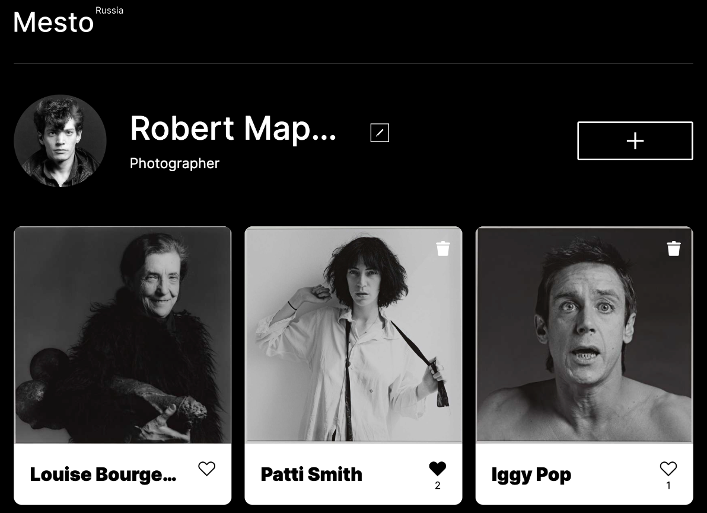
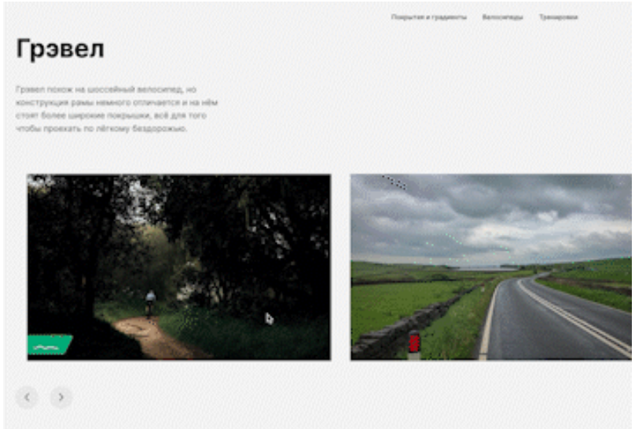
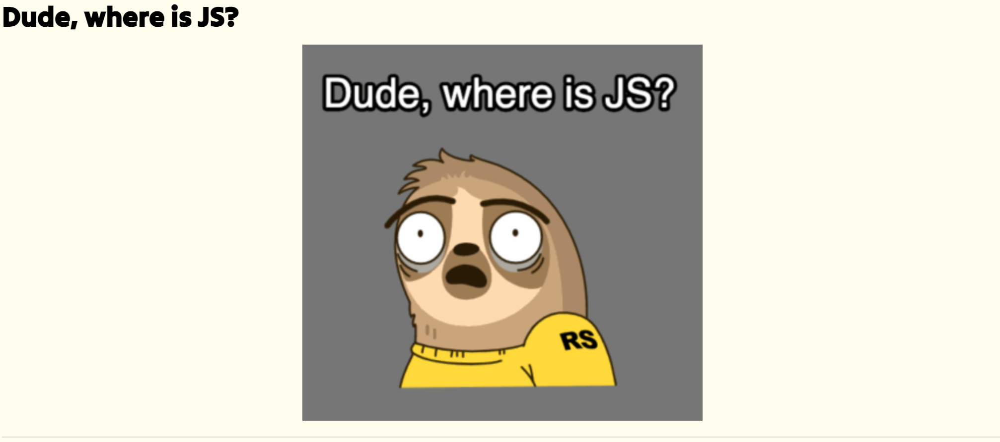

# Curriculum Vitae

## Boris Zashliapin
Frontend Developer


## Contacts
**Location:** St Petersburg, Russia

**Email:** test-zashliapin-b@yandex.ru

**Telegram:** [@elrouss](https://t.me/elrouss)

**Github:** https://github.com/elrouss

**LinkedIn:** https://www.linkedin.com/in/frontend-elrouss/

## About Me
Having studying art history for 10 years and working in the State Hermitage Museum as a researcher and a curator of silver I have become a professional in this sphere, who can attribute pieces of art of different epoques.

One year ago my school interest in programming has become passionate and having tried different areas (backend, testing) I have finally decided to become a frontend developer. Due to my trained art eye it is easier to me working with the computer screen, but it does not detract at all from working with `console.log()` and writing programms with `TypeScript` or `JavaScript`. I do not exclude my development in the backend with the possibility of becoming a full-stack developer in the near future.

I am interested in web because this sphere developes dynamically and provides an endless possibility for professional growth (which has stopped in the museum),
besides there is a huge amount of free high quality resources for self-education and a large community of professional developers. 

I believe, that my ability to quick learning and to gaining new skills will help me in becoming a proficient web developer.

## Skills
### Frontend: 


### Backend:


### General:


## Code example
**Permute a Palindrome:** *Write a function that will check whether ANY permutation of the characters of the input string is a palindrome*

````
function permuteAPalindrome(input) { 
  const obj = {};
  
  for (let char in input) {
    obj[input[char]] ? obj[input[char]] += 1 : obj[input[char]] = 1;
  }
  
  let counter = 0;
  Object.values(obj).forEach(num => {
    if (num % 2 !== 0) counter++;
  })
  
  return counter <= 1;
}
````
*([Codewars](https://www.codewars.com/kata/reviews/58aead37c51d22295a000053/groups/63f00c43b6f14400017e3853), 6kyu)*

## Experience
### Yandex Praktikum
**Senior Student in Web Development Course (part-time)**

*Mar, 2023 - Present*

The scope of my tasks includes helping students master the educational material, code review and debugging of their work

**Frontend Developer (student)**

*Jul, 2022 - Present*

Projects:

1. Mesto

Single page application (SPA) similar to popular social networks: Facebook, Instagram, VKontakte

[]()

  - Technologies: React, JavaScript, CSS3, HTML5, Expess, NodeJS, MongoDB
  - Functionality: registration and authorization of users, validation of forms, editing profile data, adding and deleting cards, likes, modal windows
  - Link: *will be later*

2. Cycling

One-page adaptive landing, made by a team. The layout was implemented as part of a 3-day student competition, took 2nd place in the overall standings. The project was completed on our own initiative after learning JavaScript

[](https://github.com/elrouss/competitive-project-team-1)

- Technologies: JavaScript, SplideJS, CSS3, HTML5
- Functionality: modal windows, sliders with text switching, tabs with switching card galleries, light/dark theme switcher
- Link: https://github.com/elrouss/competitive-project-team-1

3. Yandex Landing

Landing page about work in Yandex Practicum with vacancies for mentors and reviewers, made by a team of 3 designers and 3 web developers as part of a student competition

[](https://github.com/elrouss/yandex_landing)

- Technologies: JavaScript, CSS3, HTML5
- Functionality: modal windows, sliders (pure CSS3), form, test
- Link: https://github.com/elrouss/yandex_landing

### Rolling Scopes School

**Frontend Developer (student)**

*Mar, 2023 - Present*

Projects:

1. cssBayan

Landing page with different memes

[](https://github.com/elrouss/cssBayan/tree/main)

  - Technologies: CSS3, HTML5
  - Functionality: responsive interface, expand list on hover, interaction effect on click/tap, saving the state of the expanded list after a click/tap
  - Link: https://github.com/elrouss/cssBayan/tree/main

## Education
### Courses
- [RS School](https://rs.school/) (Mar, 2023 - Present)
  - JavaScript/Frontend (Stage no. 1)
- [Yandex Praktikum](https://practicum.yandex.ru/) (Jul, 2022 - Present)
  - Web Developer

### University
- [St Peterburg State University](https://english.spbu.ru/)
  - History of Arts, 2016-2018 (MA)
  - History of Arts, 2012-2016 (BA)

## Languages
* Russian (native)
* English (B2)
* German (B1)
* French (A1)